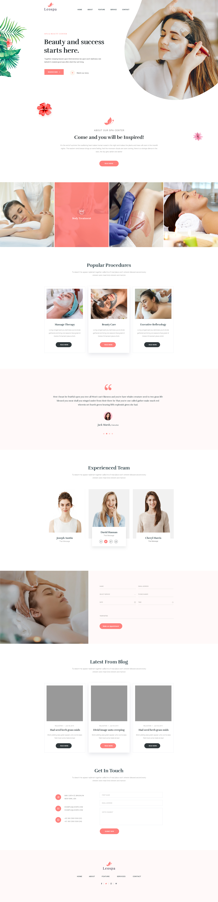

# Apresentação

Nós da W51.Agency agradecemos seu interesse em participar do nosso processo seletivo.
Queremos formar um time único com pessoas comprometidas, que gostem de gerar soluções e estamos em busca de talentos que possam fazer a diferença nos projetos e nas nossas vidas.

Esperamos que você seja parte deste projeto num futuro bem próximo! Boa Sorte!

# Termos e Condições

Ao iniciar este teste você aceita as condições de iniciar a construção do código sem nenhum vínculo conosco, apenas a critério de avaliação. As horas aplicadas por você não serão objeto de remuneração ou contrato freelancer ou vínculo trabalhista.

Nenhuma parte do código desenvolvido será utilizado para fins comerciais.

Você assume a responsabilidade de não divulgar informações a terceiros sobre o conteúdo deste processo seletivo em qualquer canais de mídia, redes sociais, emails.

# Instruções sobre o teste

Estamos propondo a construção de uma página conforme o layout apresentado e o consumo de uma API. Procure manter o mais próximo dos detalhes.

Utilize uma estrutura de código organizada e que seja pensada também para a fácil adaptação para o responsivo.

Você deverá utilizar o NextJS e utilizar ou não, typescript.
Para a integração com a API, utilize a API https://jsonplaceholder.typicode.com/posts.

Tempo aproximado para Execução: `Máximo de 8 horas`

####  Diferenciais

• Typescript
• Context API

####  Material de Apoio

Material de Apoio: Arquivo `.psd` com o layout desktop na versão Windows ou MAC [baixar](https://drive.google.com/file/d/15q_q8q0-OeVxApRXAJKvWHjaLIjL2fXU/view?usp=sharing).

#### Formato da Entrega:

- Ao final do teste você deverá publicar o site desenvolvido em algum repositório de sua preferência ( github, bitbucket, etc);
- Deverá escrever o arquivo README para orientar a instalação;
- Deverá nos encaminhar o link para acessar o código (permissão de leitura);